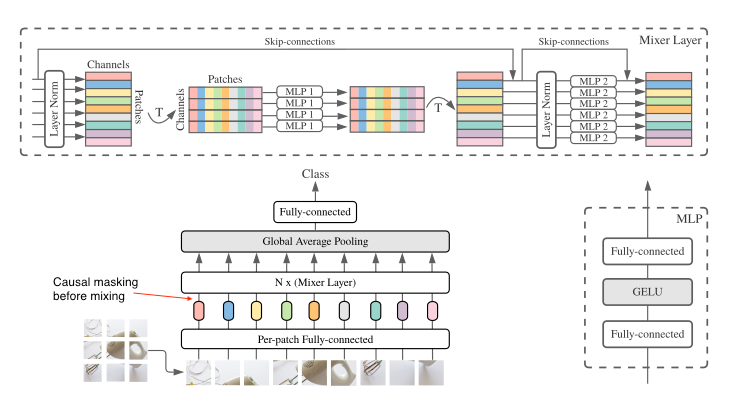

# AutoregressiveMLPMixer

A PyTorch model that adapts MLPMIxer for enforced causality.


## Citation

It is based on the following work:

```
    @misc{tolstikhin2021mlpmixer,
        title   = {MLP-Mixer: An all-MLP Architecture for Vision},
        author  = {Ilya Tolstikhin and Neil Houlsby and Alexander Kolesnikov and Lucas Beyer and Xiaohua Zhai and Thomas Unterthiner and Jessica Yung and Daniel Keysers and Jakob Uszkoreit and Mario Lucic and Alexey Dosovitskiy},
        year    = {2021},
        eprint  = {2105.01601},
        archivePrefix = {arXiv},
        primaryClass = {cs.CV}
    }
```

## Adaptation

- A triangular matrix operates on the higher-dimension projection of the patched input before the dense layer. This enforces a causal mask before information mixing; the network does not have access to future information.
- A `softmax` operation sits on the final output to adapt the original discriminatory behaviour to a generative one; we can get a probability distribution out of the network.
- **I intended it to be used for autoregressive sampling in a variational monte  carlo context, so you will see some extra methods**. But you may use it as it suits you.



## Dependecies

- [accelerate](https://huggingface.co/docs/accelerate/index)
- [einops](https://pypi.org/project/einops/)
- [pytorch](https://pytorch.org/)
